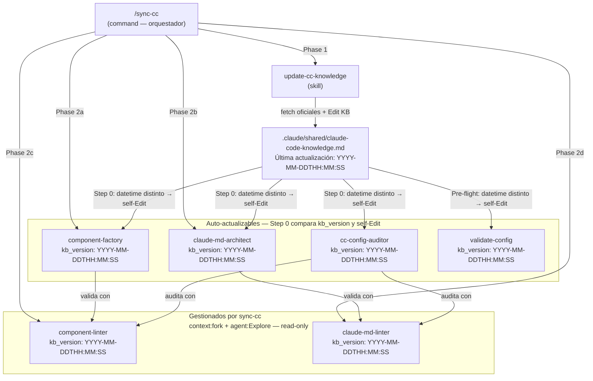

# Claude Code Configuration Management

Este directorio (`.claude/`) contiene el harness de Claude Code del proyecto Hersa. Los componentes que se documentan aquí tienen una función específica: **mantener la configuración de Claude Code siempre óptima y alineada con la plataforma**.

---

## Ecosistema de componentes



---

## Roles de cada componente

### Productores (escriben el KB)

| Componente | Tipo | Rol | Invocación |
|---|---|---|---|
| `update-cc-knowledge` | skill | Fetch de docs oficiales + actualiza §1–8 del KB con datetime | `/update-cc-knowledge` |
| `sync-cc` | command | Orquesta: actualiza KB → auto-actualiza CMA y CF → ofrece validate | `/sync-cc` |

> Los productores escriben `Última actualización: YYYY-MM-DDTHH:MM:SS` en el KB. Esa timestamp es la llave de sincronización.

### Consumidores (leen el KB y se auto-actualizan)

| Componente | Tipo | Rol | `kb_version` tracks |
|---|---|---|---|
| `claude-md-architect` (Jesus) | agent | Genera y migra CLAUDE.md siguiendo §1, §9.1, §9.8 | §1, §9.1, §9.8 |
| `component-factory` (Dios) | agent | Scaffold de agentes y skills siguiendo §2, §3, §9.2–9.8 | §2, §3, §9.2–9.8 |
| `cc-config-auditor` (Marco) | agent | Audita toda la config CC + roadmap + diagramas | §1–9 (todos) |
| `validate-config` | command | 14 checks específicos + scoring /10 + feature adoption gap | §2.2, §3.2–3.3, §5.5, §9.4, §9.8 |

### Validadores (herramientas de los consumidores)

| Componente | Tipo | Rol | Actualizado por |
|---|---|---|---|
| `claude-md-linter` | skill | Lint de CLAUDE.md contra best practices | `sync-cc` Phase 2d |
| `component-linter` | skill | Lint de agents/skills contra frontmatter spec | `sync-cc` Phase 2c |

> **Por qué no se auto-actualizan:** Ambos usan `context: fork` + `agent: Explore`, que ejecuta el skill en un subagente Explore read-only. Darles Write/Edit requeriría eliminar su aislamiento y cambiaría su naturaleza de validadores puros. Un linter que edita sus propias reglas mientras valida es un anti-patrón. `sync-cc` asume esa responsabilidad.

---

## Mecanismo de auto-actualización

### ¿Cómo funciona?

Cada consumidor tiene dos elementos que trabajan juntos:

**1. Campo `kb_version` en frontmatter:**
```yaml
kb_version: "2026-04-29T00:00:00"
```
Registra contra qué versión del KB fue calibrado el componente.

**2. Step 0 / Pre-flight al inicio de cada ejecución:**
```bash
grep "Última actualización" .claude/shared/claude-code-knowledge.md | head -1
```
Extrae el datetime del KB y lo compara con `kb_version`.

### Flujo de decisión

```
kb_version == KB datetime?
    ├── SÍ → Continuar normalmente
    └── NO → Leer KB completo
              → Edit: actualizar secciones afectadas del componente
              → Edit: actualizar kb_version en frontmatter
              → Prefijar output: 🔄 Self-updated [old → new]: [changes]
              → Continuar con el protocolo actualizado
```

### Qué puede editar cada consumidor (scope boundary)

| Componente | Puede editar | NO puede editar |
|---|---|---|
| `claude-md-architect` | Sus propias Phases (body) + `kb_version` | Cualquier otro archivo |
| `component-factory` | Sus propios Steps (body) + `kb_version` | Cualquier otro archivo |
| `cc-config-auditor` | Sus propios domain checks (body) + `kb_version` | Cualquier otro archivo |
| `validate-config` | Sus propios checks A–N (body) + `kb_version` | Cualquier otro archivo |

> Los consumidores **solo** usan `Write`/`Edit` sobre sí mismos. Nunca tocan código de aplicación, ni archivos de otros agentes, ni la KB.

---

## Formato de datetime

**ISO 8601 con segundos:** `YYYY-MM-DDTHH:MM:SS`

Ejemplos:
- `2026-04-29T00:00:00` — migración inicial sin timestamp horario registrado
- `2026-05-15T14:32:07` — actualización real con hora exacta

Tanto el KB header como todos los `kb_version` usan este formato. La comparación es string-exact: si no son idénticos, se dispara la auto-actualización.

---

## Guía de uso

### Actualizar todo el ecosistema (flujo estándar)

```
/sync-cc
```

Esto:
1. Descarga docs oficiales y actualiza el KB (§1–8) con datetime actual
2. Auto-actualiza `claude-md-architect` y `component-factory` contra el KB nuevo
3. Ofrece correr `/validate-config` al final

La próxima vez que se invoque cualquier consumidor, su Step 0 detectará la nueva datetime y se auto-actualizará.

### Solo actualizar el KB (sin sync de agentes)

```
/update-cc-knowledge
```

### Auditoría completa de la configuración

```
/validate-config          # 14 checks, scoring /10
@cc-config-auditor        # Diagrama de topología + roadmap 3 fases
```

### Verificar que un componente está calibrado

Abrir el archivo y comparar:
```bash
grep "kb_version" .claude/agents/component-factory.md
grep "Última actualización" .claude/shared/claude-code-knowledge.md
```
Si los datetimes no coinciden, el componente se auto-actualizará en su próxima ejecución.

---

## Cuándo intervenir manualmente

| Situación | Acción |
|---|---|
| La auto-actualización rompe un protocolo existente | Revertir con `git checkout` + reporte a la sesión |
| Se añade un componente nuevo CC-related | Añadir `kb_version` + Step 0 (ver patrón estándar arriba) |
| El KB §9 (Best Practices) cambia | Editar manualmente — §9 es estable, los productores no lo tocan |
| Un consumidor expande sus propios permisos en auto-update | Bug crítico — abrir issue, revertir inmediatamente |

---

## Añadir un nuevo componente al ecosistema

Si creas un agente, skill o command que lee `.claude/shared/claude-code-knowledge.md` para tomar decisiones, debe tener el mecanismo de auto-actualización:

1. **Frontmatter:** añadir `kb_version: "YYYY-MM-DDTHH:MM:SS"` (usar el datetime actual del KB)
2. **Body:** añadir Step 0 / Pre-flight con el patrón estándar (ver sección anterior)
3. **Scope boundary:** documentar explícitamente qué secciones del KB afectan a este componente
4. **Tools:** asegurarse de que `Write` y `Edit` estén en la lista de herramientas permitidas

---

*Actualizado: 2026-04-30 | Branch: HRS-33/refactor-claude-harness-shared-context*
