# Claude Code — Configuración del Harness

Diagrama de la arquitectura completa de la configuración de Claude Code para el proyecto Hersa.

```mermaid
graph TB
    classDef agent fill:#4A90D9,stroke:#2C5F8A,color:#fff
    classDef skill fill:#7B68EE,stroke:#5A4DB0,color:#fff
    classDef shared fill:#20B2AA,stroke:#148F8F,color:#fff
    classDef rule fill:#FF8C00,stroke:#CC6E00,color:#fff
    classDef cmd fill:#32CD32,stroke:#228B22,color:#fff
    classDef config fill:#DC143C,stroke:#A00F28,color:#fff
    classDef infra fill:#708090,stroke:#4A5568,color:#fff

    %% Nucleo
    CLAUDE["CLAUDE.md - punto de entrada"]:::config
    SETTINGS["settings.json + settings.local.json"]:::config
    HOOK["deny-secret-commits.sh - PreToolUse hook"]:::config

    CLAUDE --> SETTINGS
    SETTINGS --> HOOK

    %% Comandos slash
    subgraph COMMANDS["Comandos slash - 6"]
        C1["start-task"]:::cmd
        C2["create-task"]:::cmd
        C3["capture-task"]:::cmd
        C4["pr-create"]:::cmd
        C5["sync-cc"]:::cmd
        C6["validate-config"]:::cmd
    end
    CLAUDE --> COMMANDS

    %% Shared Context
    subgraph SHARED["Shared Context - 14 archivos"]
        SC1["hersa-context.md"]:::shared
        SC2["hersa-process.md"]:::shared
        SC3["pipeline-workflows.md"]:::shared
        SC4["agents-registry.md"]:::shared
        SC5["claude-code-knowledge.md"]:::shared
        SC6["context-index.md"]:::shared
        SC7["colombia-data-protection-law.md"]:::shared
        SC8["linear-setup + ticket-template"]:::shared
        CONV["conventions - api, errors, security, ui, workflow"]:::shared
    end
    CLAUDE --> SHARED

    %% Rules path-scoped
    subgraph RULES["Rules path-scoped - 6"]
        R1["frontend - react-conventions"]:::rule
        R2["frontend - mui-conventions"]:::rule
        R3["frontend - typescript"]:::rule
        R4["frontend - styling"]:::rule
        R5["frontend - theme-tokens"]:::rule
        R6["backend - backend-conventions"]:::rule
    end
    CLAUDE --> RULES

    %% Skills
    subgraph SKILLS["Skills - 12"]
        SK1["agent-scaffold"]:::skill
        SK2["skill-scaffold"]:::skill
        SK3["reuse-checker"]:::skill
        SK4["component-linter"]:::skill
        SK5["claude-md-linter"]:::skill
        SK6["pipeline-flows"]:::skill
        SK7["pipeline-runner"]:::skill
        SK8["pipeline-conventions"]:::skill
        SK9["developer-conventions"]:::skill
        SK10["review-conventions"]:::skill
        SK11["pipeline-trace-linter"]:::skill
        SK12["update-cc-knowledge"]:::skill
    end

    %% Agentes - Desarrollo
    subgraph DEV["Agentes - Desarrollo"]
        A1["django-developer - Chao"]:::agent
        A2["react-developer - Manuel"]:::agent
        A3["component-factory - Dios"]:::agent
    end

    %% Agentes - Pipeline Docs
    subgraph PIPELINE["Agentes - Pipeline Docs"]
        A4["pm-discovery"]:::agent
        A5["pm-writer"]:::agent
        A6["prd-writer"]:::agent
        A7["systems-analyst"]:::agent
        A8["tdd-writer"]:::agent
    end

    %% Agentes - QA y Revision
    subgraph QA["Agentes - QA y Revision"]
        A9["test-writer"]:::agent
        A10["qa-engineer - Maria"]:::agent
        A11["docs-writer"]:::agent
        A12["code-reviewer - Melba"]:::agent
        A13["security-auditor - Vigi"]:::agent
        A14["release-manager"]:::agent
        A15["adr-writer"]:::agent
        A16["ethical-hacker - Pecueca"]:::agent
    end

    %% Agentes - Diseno y Analisis
    subgraph DESIGN["Agentes - Diseno y Analisis"]
        A17["ux-designer - Lau"]:::agent
        A18["ui-designer - Jose"]:::agent
        A19["brand-designer - Lina"]:::agent
        A20["process-analyst"]:::agent
        A21["process-optimizer"]:::agent
        A22["data-analyst - Paolo"]:::agent
        A23["engineering-manager - Alex"]:::agent
        A24["senior-ceo-advisor - Fran"]:::agent
        A25["legal-compliance-advisor - Felix"]:::agent
    end

    %% Agentes - Ops y Plataforma
    subgraph OPS["Agentes - Ops y Plataforma"]
        A26["aws-devops - Jairito"]:::agent
        A27["claude-md-architect - Jesus"]:::agent
        A28["cc-config-auditor - Marco"]:::agent
        A29["communications-writer - Vicky"]:::agent
    end

    %% Infraestructura externa
    subgraph INFRA["Infraestructura externa"]
        LIN[("Linear MCP")]:::infra
        GH[("GitHub")]:::infra
        AWS[("AWS - EB + S3 + RDS")]:::infra
    end

    %% Relaciones Skills -> Agentes
    SK1 --> A3
    SK2 --> A3
    SK3 --> A3
    SK4 --> A3
    SK5 --> A27
    SK6 --> SK7
    SK8 --> A4
    SK8 --> A5
    SK8 --> A6
    SK8 --> A7
    SK8 --> A8
    SK9 --> A1
    SK9 --> A2
    SK9 --> A8
    SK9 --> A9
    SK10 --> A12
    SK10 --> A13
    SK11 --> A8
    SK12 --> C5

    %% Relaciones Comandos -> Infra
    C1 --> LIN
    C2 --> LIN
    C3 --> LIN
    C4 --> GH
    C5 --> SK12
    C6 --> A28
    A26 --> AWS
    SETTINGS --> LIN

    %% KB auto-actualizacion
    SC5 -.->|kb_version sync| A27
    SC5 -.->|kb_version sync| A3
    SC5 -.->|kb_version sync| A28
    C5 -.->|orquesta| SC5
```

## Resumen

| Componente | Cantidad |
|---|---|
| Agentes (con personas) | 29 |
| Skills | 12 |
| Shared context | 14 archivos |
| Rules path-scoped | 6 archivos |
| Comandos slash | 6 |
| Hooks | 1 |

## Ejes estructurales

1. **`CLAUDE.md`** — punto de entrada que carga todo lo demás
2. **`shared/pipeline-workflows.md`** — motor de orquestación (flujos A–J)
3. **`shared/claude-code-knowledge.md`** — KB que se auto-sincroniza vía `/sync-cc`
