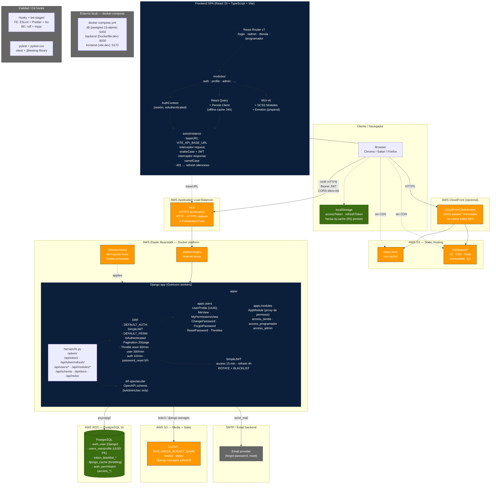

# Arquitectura técnica — Hersa

Hersa es un monorepo desacoplado: React 19 + Vite (frontend) y Django 5.2 + DRF (backend) viven en el mismo repo pero se despliegan de forma independiente sobre AWS.

## Capas

| Capa | Tecnología | Notas |
|---|---|---|
| Cliente | React 19 + TypeScript + Vite + MUI v6 | SPA, SCSS Modules, React Query persist 24h |
| CDN | CloudFront (opcional) | assets immutable 1y, index.html no-cache |
| Static hosting | S3 | deploy via `scripts/cf-deploy.sh` |
| Red | ALB | HTTPS termination, CORS allow-list |
| Backend | Django 5.2 + DRF + Gunicorn | Elastic Beanstalk Docker |
| Auth | SimpleJWT | access 15min, refresh 4h, rotate + blacklist |
| Persistencia | PostgreSQL 16 (RDS) | UUID PKs, throttling en `django_cache` |
| Archivos | S3 (django-storages s3boto3) | media/ + static/ en producción |
| Email | SMTP configurable | console en dev, proveedor externo en prod |

## Flujos críticos

### Login
1. `POST /api/token/` con credenciales → SimpleJWT devuelve `{ access, refresh }`
2. Frontend guarda ambos en `localStorage`, hidrata perfil + permisos (`access_tienda`, `access_programador`, `access_admin`)

### Request autenticada
1. `axiosInstance` añade `Authorization: Bearer <accessToken>`
2. Si 401 → refresh silencioso con `POST /api/token/refresh/`
3. Si refresh falla → logout + redirect a login
4. Response snake_case → interceptor convierte a camelCase → React Query cachea

### Deploy frontend
`npm run build` → `aws s3 sync` assets immutable + index.html no-cache → invalidación CloudFront opcional

### Deploy backend
`eb deploy` → Docker rebuild → `.ebextensions` ejecuta `migrate` + `createcachetable` → Gunicorn arranca

## Riesgos identificados

1. **Sin CI/CD automatizado** — deploys manuales por scripts; cualquier persona con credenciales puede romper producción
2. **Sin Celery/Redis** — tareas pesadas (emails masivos, PDFs de diplomas, procesamiento de fotos) bloquearán el request HTTP
3. **Throttling en RDS** — funciona hoy, pero bajo carga hay que migrar a ElastiCache
4. **`apps.modules` casi vacío** — solo declara permisos; la lógica de dominio (toga, auditorio, fotos, diplomas) aún no existe como código
5. **Sin observabilidad** — no hay Sentry, CloudWatch dashboards ni structured logging configurado
6. **Refresh token en localStorage** — riesgo XSS; decisión consciente para colegios con dispositivos compartidos
