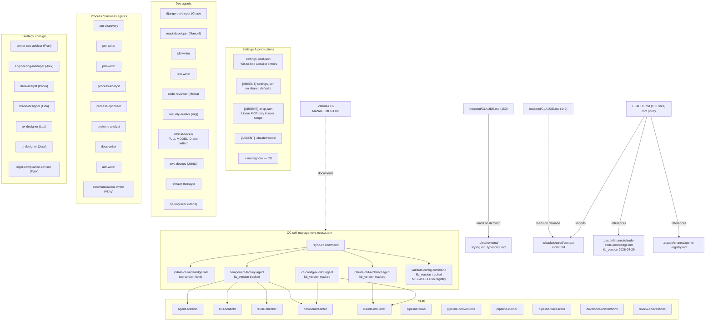
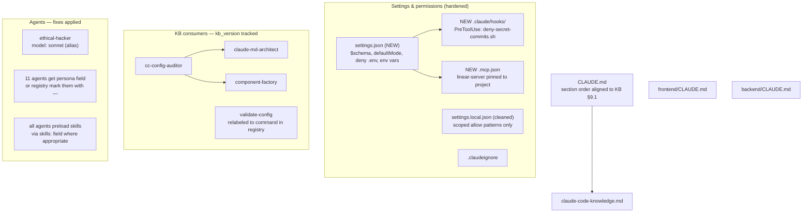

# Claude Code Configuration Audit — Hersa

| Field | Value |
|---|---|
| Date | 2026-04-30 |
| Auditor | `cc-config-auditor` (Marco) |
| Knowledge Base version | `2026-04-29T00:00:00` |
| KB path | `.claude/shared/claude-code-knowledge.md` |
| Branch | `HRS-33/refactor-claude-harness-shared-context` |
| Self-update triggered | No (kb_version matches KB) |

All findings cite specific KB sections. The KB is the single source of truth for best practices — every recommendation traces back to a section.

---

## Section 1 — Architecture diagrams

### 1.1 Current state



### 1.2 Target state (post-roadmap)



---

## Section 2 — Domain scores

| # | Domain | Score | Findings | Notes |
|---|---|---|---|---|
| A | CLAUDE.md (root + path-scoped) | **PASS** | 0 critical, 4 medium | Excellent line discipline (103/150/149), good imports, but section order and registry pointer drift |
| B | Agents (29 total) | **WARN** | 1 critical, 6 medium, 4 low | Strong base (model declared on all 29) but `ethical-hacker` uses full model ID — anti-pattern KB §9.4 |
| C | Skills (12 total) | **PASS_WITH_WARNINGS** | 0 critical, 5 medium | All have `name`/`description`/`allowed-tools`. `update-cc-knowledge` lacks `version`. Two skills duplicate `name:` line |
| D | Settings | **FAIL** | 2 critical, 3 medium | No `settings.json`, no `.mcp.json`, no `defaultMode`, no `.env` deny rule. `settings.local.json` is polluted with ad-hoc bash patterns |
| E | Hooks | **N/A** | — | Not configured. Optional per KB §5 — flagged as adoption gap |
| F | Anti-patterns | **WARN** | 2 instances | Full model ID in 1 agent; registry/FS drift on 1 component |
| **OVERALL** | (B and D double-weighted) | **WARN** | 3 critical, 18 medium, 6 low | Configuration is structurally sound but Domain D drags the score |

Score formula (KB §9.4 + project rules):
- PASS = ≥80% checks pass + zero CRITICAL
- WARN = 50–79% pass OR unresolved WARN items
- FAIL = <50% pass OR any CRITICAL failure

---

## Section 3 — Findings

Severity legend: **CRITICAL** = security or anti-pattern blocking trust; **HIGH** = feature regression or correctness; **MEDIUM** = best-practice deviation; **LOW** = polish.

### Domain A — CLAUDE.md

| ID | Sev | Location | KB | Finding | Fix | Effort |
|---|---|---|---|---|---|---|
| A-01 | MEDIUM | `CLAUDE.md` | §9.1 | Section order does not follow canonical KB order: Project → Stack → Commands → Conventions → Structure → Agent Registry → Skill Registry → Pitfalls. Current order leads with Business Context then Structure, with Commands buried. | Reorder so `Stack`/`Commands`/`Conventions` precede `Structure`/`Do Not Touch`. Move `Workflows` and `Conventions for Agents and Skills` to the bottom group. | S |
| A-02 | MEDIUM | `CLAUDE.md:74-76` | §9.1 | "Agent & Skill Registry" header in root CLAUDE.md is a single-link pointer; KB §9.1 requires the table inline (or a placeholder) so Claude does not need an extra fetch. | Inline the agent/skill table (kebab-case + persona + 1-line trigger) or add a stub like `(see .claude/shared/agents-registry.md — full registry)` and accept the trade-off. Current label suggests presence but content is offloaded. | S |
| A-03 | MEDIUM | `CLAUDE.md:38` | §9.1 | "Keep always the CLAUDE.md updated…" — soft phrasing; KB §9.1 demands MUST/NEVER vocabulary for hard rules. | Rewrite as `MUST update CLAUDE.md when introducing new conventions, agents, skills, or directories`. | S |
| A-04 | LOW | `frontend/CLAUDE.md:34-40` | §9.1 | Brand System block contains 4 imperative bullets that read as procedural ("Never change `_variables.scss` without updating brand-manual"). Acceptable as policy — but verify they aren't duplicated in `documentation/brand/digital-guidelines.md`. | Audit overlap; if brand-manual.md restates these, keep only here and remove from manual (or vice versa) to satisfy DRY (KB §9.1). | S |
| A-05 | LOW | `CLAUDE.md:40-41` | §9.1 | Two blank lines before `## Do Not Touch` (cosmetic). | Collapse to single blank line. | XS |
| A-06 | MEDIUM | `.claude/rules/frontend/styling.md:8` | §1.3 | Rule file uses `## Styling — SCSS Modules` as the title heading. KB §1.3 examples use H1 (`# API Rules`) for rule titles, then H2 only for subsections. | Promote line 8 to `# Styling rules` and demote sub-sections accordingly. Same applies to `typescript.md`. | S |

### Domain B — Agents

| ID | Sev | Location | KB | Finding | Fix | Effort |
|---|---|---|---|---|---|---|
| B-01 | **CRITICAL** | `.claude/agents/ethical-hacker.md:11` | §9.4 (Full model IDs anti-pattern) | `model: claude-sonnet-4-6` is a full model ID. KB §9.4 explicitly flags this: "se vuelve obsoleto en cada actualización de modelo". Every other agent uses an alias. | Change to `model: sonnet`. | XS |
| B-02 | HIGH | `agents-registry.md:53` vs filesystem | §9.1 (Registry integrity) | Registry lists `validate-config` under **Skills** but `.claude/skills/validate-config/` does not exist — the file lives at `.claude/commands/validate-config.md`. This is a registry/filesystem drift; `claude-md-linter` check #18 fails. | Move the row out of the Skills table; either add a Commands subsection in the registry or list it under the agents/orchestration section. | S |
| B-03 | MEDIUM | 11 agent files | Project rule (CLAUDE.md:87 + agents-registry.md style) | 11 agents have NO `persona:` field: `adr-writer`, `docs-writer`, `pm-writer`, `process-analyst`, `pm-discovery`, `release-manager`, `prd-writer`, `tdd-writer`, `process-optimizer`, `systems-analyst`, `test-writer`. Registry shows `—` for those, confirming the gap. The recent commit `67e3841` added personas to the rest — these were missed. | Either (a) add personas (preferred — uniform UX) or (b) confirm with explicit decision that these agents stay anonymous and document the rule. | M |
| B-04 | MEDIUM | `.claude/agents/cc-config-auditor.md` (this file) | §9.2 | `tools: Read, Grep, Glob, Bash, Write, Edit` = 6 tools. KB §9.2 requires per-tool justification when >5; current file has no inline rationale. | Either drop one (`Glob` overlaps with `Grep -r`) or convert to YAML list with one-line `# justification` per tool — same pattern as `data-analyst`. | S |
| B-05 | MEDIUM | `.claude/agents/claude-md-architect.md` | §9.2 | `tools: [Read, Write, Edit, Glob, Bash]` = 5 tools (at threshold). Inline tools (no justification) — fine for ≤5 but the project pattern (data-analyst, legal-compliance-advisor) uses YAML list with rationale. Inconsistent style. | Convert to YAML list with one-line rationale for parity with `component-factory`, `data-analyst`, `legal-compliance-advisor`. | S |
| B-06 | MEDIUM | `agents-registry.md:53` | §9.1 | Registry row for `validate-config` includes implementation detail ("14 checks, 10/10 scoring; supports `--quick`") inside the trigger column. KB §9.1 says triggers should be one-line hooks. | Trim to: ` /validate-config — full CC config audit`. Move detail to the command file. | XS |
| B-07 | LOW | `.claude/agents/code-reviewer.md:7` | §3.6 (memory field) | `memory: project` declared but no `## Memory Policy` section explains what gets stored. KB §3.6 documents this field but the agent body should cite use cases. | Add a 3-line "Memory Policy" section: what to save, what not to save. | S |
| B-08 | LOW | `.claude/agents/cc-config-auditor.md:25` | §3.6 + §3.13 | `memory: project` declared on this agent but the memory directory `.claude/agent-memory/cc-config-auditor/` is empty. Either start using it or remove the declaration. | Decide: if used, document scope; if not, drop the field. | XS |
| B-09 | LOW | `.claude/agents/aws-devops.md:18` | §9.2 | Body section labeled `## Use When / Do Not Use When` (combined). KB §9.2 prefers two distinct sections so each is independently scannable. | Split into `## When to Use` and `## When Not to Use`. | XS |
| B-10 | LOW | `.claude/agents/communications-writer.md:1-26` | §3.2 | Uses YAML `when_to_use:`/`when_not_to_use:` in frontmatter (valid for skills per §2.2) but for agents this duplicates with H2 sections in the body for most other agents. Inconsistent style across project. | Pick one convention (frontmatter list or H2 body section) and make it project-wide via `agent-scaffold`. | M |
| B-11 | MEDIUM | `agents-registry.md:5-35` | §9.1 | Registry duplicates fields already in each agent file (`description`, `when_to_use`). KB §9.1 prefers a one-line trigger pointer; the project version is fine but watch DRY drift on update. | Add a CI check (or use `claude-md-linter`) to flag mismatch between registry trigger and agent description. | M |

### Domain C — Skills

| ID | Sev | Location | KB | Finding | Fix | Effort |
|---|---|---|---|---|---|---|
| C-01 | MEDIUM | `.claude/skills/agent-scaffold/SKILL.md:1` and `.claude/skills/skill-scaffold/SKILL.md:1` | §2.2 | Both files contain `^---$` four times (frontmatter delimiters appearing twice each). Likely copy-paste artifact: a second `---` block embedded in the body that confuses YAML parsers expecting the first `---...---` to close cleanly. | Read both files end-to-end and remove the second YAML block. | S |
| C-02 | MEDIUM | `.claude/skills/update-cc-knowledge/SKILL.md` | §2.2 | Missing `version:` field. Other skills track `version: 1.0.0`/`1.1.0`. KB §2.2 lists version as standard but not required — project consistency demands it. | Add `version: 1.0.0`. | XS |
| C-03 | MEDIUM | `.claude/skills/agent-scaffold/SKILL.md:7` | §2.5 + §3.5 | The skill is referenced via `component-factory.skills:` (preload). It does NOT have `disable-model-invocation: true`, so it can also be auto-invoked. That's fine, but ensure `reuse-checker` is the only one that decides to call it — otherwise model can scaffold without going through the gate. | Document in the skill's "When NOT to Use" that direct invocation must come through `component-factory`. | S |
| C-04 | MEDIUM | `.claude/skills/reuse-checker/SKILL.md:6-8` | §2.6 + §3.5 | Skill declares `context: fork` + `agent: Explore`. Per KB §3.5: skills with subagent fork CANNOT be safely preloaded into another agent's context (the fork already strips parent context). Verify `component-factory` does NOT preload `reuse-checker` via `skills:` — call it as a slash skill instead. | Read `component-factory.md`; if `reuse-checker` is in its `skills:` list, remove it and call it via inline `/reuse-checker` flow. | S |
| C-05 | LOW | All scaffold skills | §9.3 | Procedure section in some skills exceeds 100 lines — within budget but approaches the 500-line ceiling. Move long examples to `examples/` per KB §9.3. | Audit `pipeline-flows` (190) and `skill-scaffold` (172) for content that can move to bundled examples. | M |

### Domain D — Settings

| ID | Sev | Location | KB | Finding | Fix | Effort |
|---|---|---|---|---|---|---|
| D-01 | **CRITICAL** | (absent) `.claude/settings.json` | §6.1 + §6.4 | No project-level `settings.json` exists. The only config is `settings.local.json` (gitignored, user-only). KB §6.1 requires the project file to declare shared `defaultMode`, `permissions.deny`, `env`, `$schema`. Without it, every developer relies on personal allowlists — irreproducible behavior across the team. | Create `.claude/settings.json` with: `$schema`, `defaultMode: "default"`, `permissions.deny: ["Read(./.env)", "Read(./.env.production)", "Read(**/secrets/**)"]`, plus shared `permissions.allow` for canonical bash commands (`Bash(docker compose *)`, `Bash(npm run *)`, `Bash(pipenv run *)`, `Bash(git *)`). Commit it. | M |
| D-02 | **CRITICAL** | (absent) `.mcp.json` at repo root | §8.1 | Linear MCP is in use (allowlist line 17–22 in `settings.local.json`) but there is no committed `.mcp.json`. The server is configured at user level, so no other developer can collaborate without manual setup, and the tool grants in `settings.local.json` reference servers that may not exist on a fresh clone. | Create `.mcp.json` at repo root declaring `linear-server` (transport, args). Document the env-var requirements in `CLAUDE.md`. KB §8.1 shows the schema. | M |
| D-03 | MEDIUM | `.claude/settings.local.json:30-50` | §6.4 | The allow array has ~20 ad-hoc bash patterns committed (e.g., `Bash(awk '/^---/{count++; if\\(count==2\\){found=1; next}} ...')`). These were silently appended each time the user accepted an exotic command. They are dead noise that grows unbounded. | Rewrite the allow list to ~10 broad-but-safe patterns (`Bash(awk *)`, `Bash(sed *)`, `Bash(grep *)`). Move repository-specific paths under `Bash(awk *)` umbrella. KB §6 favors broad allow + targeted deny. | S |
| D-04 | MEDIUM | `.claude/settings.local.json:23` | §2.5 + §6.4 | `Skill(update-config)` is allowed but no skill named `update-config` exists. Either dead allowlist or stale alias. | Remove or rename to match a real skill. | XS |
| D-05 | MEDIUM | `.claudeignore` | §1.7 | OK at root level, but consider also denying `.claude/agent-memory/` (or be explicit that we keep it — currently it is committed empty per `cc-config-auditor/` directory). | Decide: commit memory directory (current behavior) or `.claudeignore` it. Document the choice. | XS |

### Domain E — Hooks

| ID | Sev | Location | KB | Finding | Fix | Effort |
|---|---|---|---|---|---|---|
| E-01 | MEDIUM | (absent) | §5 | No hooks configured. Project-relevant adoption opportunities per KB §5.5 (events that can block via exit 2): `PreToolUse` matcher `Bash(git commit *)` to scan for `.env` content; `PreToolUse` matcher `Write` to block writes outside the project root; `UserPromptSubmit` to inject the current Linear ticket id. | Add `.claude/hooks/deny-secret-commits.sh` and wire from `settings.json`. Use exit 2 (not exit 1) — KB §5.4. Quote `"$CLAUDE_PROJECT_DIR"`. | L |

### Domain F — Anti-patterns

| ID | Sev | Location | KB | Finding | Fix | Effort |
|---|---|---|---|---|---|---|
| F-01 | CRITICAL | `ethical-hacker.md` | §9.4 (Full model IDs) | Already captured as B-01. | (See B-01) | XS |
| F-02 | MEDIUM | `agents-registry.md` | §9.4 (Skill sprawl risk) | 12 skills, 29 agents — within tolerance, but `pipeline-conventions`, `pipeline-flows`, `pipeline-runner`, `pipeline-trace-linter` overlap in name space and could confuse auto-invocation. KB §9.4 calls this out. | Audit triggers in each: ensure descriptions are sharply differentiated. Consider merging `pipeline-conventions` into `pipeline-flows` if their `description:` overlap is >50%. | M |
| F-03 | LOW | (settings.local.json) | §9.4 (Tool over-grant) | Allowlist line 30 (`Bash([ -f \"...\" ])`) and lines 31–50 are over-specific tool grants for one-off audits — accumulating cruft. | See D-03. | XS |

---

## Section 4 — Roadmap

### Phase 1 — Critical (this sprint, ≤2 hours)

These three changes unblock the FAIL on Domain D and the CRITICAL on Domain B.

#### 1.1 Fix `ethical-hacker` model alias (B-01 / F-01)

```diff
--- a/.claude/agents/ethical-hacker.md
+++ b/.claude/agents/ethical-hacker.md
@@ -8,7 +8,7 @@ tools:
   - Bash       # run pentest tools, nmap, sqlmap, burp/zap CLI
   - Write      # produce findings reports under documentation/security/
   - Grep       # search codebases and pcaps for vulnerabilities and patterns
   - WebFetch   # fetch CVE databases and exploit references
-model: claude-sonnet-4-6
+model: sonnet
```

#### 1.2 Create `.claude/settings.json` (D-01)

```json
{
  "$schema": "https://json.schemastore.org/claude-code-settings.json",
  "defaultMode": "default",
  "permissions": {
    "deny": [
      "Read(./.env)",
      "Read(./.env.production)",
      "Read(./backend/.env)",
      "Read(./backend/.env.production)",
      "Read(./frontend/.env)",
      "Read(./frontend/.env.production)",
      "Read(**/secrets/**)",
      "Read(**/credentials.json)"
    ],
    "allow": [
      "Bash(docker compose *)",
      "Bash(npm run *)",
      "Bash(pipenv run *)",
      "Bash(pipenv install *)",
      "Bash(git *)",
      "Bash(gh issue *)",
      "Bash(gh api *)",
      "WebFetch(domain:docs.anthropic.com)",
      "WebFetch(domain:docs.claude.ai)",
      "WebFetch(domain:mui.com)",
      "WebSearch"
    ]
  },
  "env": {
    "PROJECT_ROOT_LABEL": "hersa"
  }
}
```

Then trim `settings.local.json` to user-specific paths only.

#### 1.3 Commit `.mcp.json` for Linear (D-02)

```json
{
  "mcpServers": {
    "linear-server": {
      "command": "npx",
      "args": ["-y", "@linear/mcp"],
      "env": {
        "LINEAR_API_KEY": "${LINEAR_API_KEY}"
      }
    }
  }
}
```

Document `LINEAR_API_KEY` in `.env.example`.

#### 1.4 Fix registry / FS drift on `validate-config` (B-02)

Edit `.claude/shared/agents-registry.md` — move the row out of the Skills table; create a Commands subsection or note in the agents area.

### Phase 2 — Structural (next sprint)

| Item | Files | Effort |
|---|---|---|
| Add `persona:` to 11 agents OR document anonymity rule (B-03) | 11 agent files + style guide | M |
| Convert all agents to YAML-list `tools:` with inline rationale, OR all to inline list — pick one (B-04, B-05, B-10) | All 29 agents (style pass) | M |
| Fix double `---` in `agent-scaffold` and `skill-scaffold` (C-01) | 2 SKILL.md files | S |
| Add `version:` to `update-cc-knowledge` skill (C-02) | 1 file | XS |
| Reorder root CLAUDE.md sections to canonical KB §9.1 order (A-01) | 1 file | S |
| Promote rule files from H2 title to H1 (A-06) | 2 rule files | S |
| Strengthen MUST/NEVER vocabulary in CLAUDE.md (A-03) | 1 file | S |
| Verify `reuse-checker` is not preloaded in `component-factory.skills` (C-04) | 1 verification step | S |

### Phase 3 — Polish (backlog)

- Add `PreToolUse` hook to block `.env` content in `git commit` payloads (E-01) — needs script and integration.
- Audit overlap between `pipeline-conventions` and `pipeline-flows` skills (F-02).
- Move long procedure blocks in `pipeline-flows.md` and `skill-scaffold/SKILL.md` to bundled `examples/` (C-05).
- Add CI step that runs `claude-md-linter` and `component-linter` on changed files.
- Decide and document whether `.claude/agent-memory/` is committed or ignored (D-05).

---

## Section 5 — Quick wins (≤15 min each, ordered by ROI)

| # | Action | File(s) | Why now |
|---|---|---|---|
| 1 | Replace `claude-sonnet-4-6` → `sonnet` in `ethical-hacker.md` | `.claude/agents/ethical-hacker.md` | Removes the only CRITICAL anti-pattern; one-line edit |
| 2 | Move `validate-config` row out of Skills table in `agents-registry.md` | `.claude/shared/agents-registry.md` | Fixes registry/FS drift; restores `claude-md-linter` integrity check |
| 3 | Add `version: 1.0.0` to `update-cc-knowledge/SKILL.md` | 1 file | Brings skill in line with the project standard |
| 4 | Remove `Skill(update-config)` (dead allowlist entry) and the ~20 `Bash(awk '...')` lines from `settings.local.json` | `.claude/settings.local.json` | Reduces signal-to-noise in the file Claude consults on every tool call |
| 5 | Strip implementation detail from `validate-config` registry row | `.claude/shared/agents-registry.md:53` | Aligns with KB §9.1 trigger style |

---

## Appendix A — Component inventory

- **CLAUDE.md files (3):** root (103 LOC), `frontend/` (150), `backend/` (149) — all within KB §9.1 ≤200/≤150 budgets.
- **Agents (29):** 100% declare `model:`. 1 uses full model ID. 28/29 have `when_to_use`/`when_not_to_use` either as frontmatter or H2 sections. 11 lack `persona:`.
- **Skills (12):** 100% declare `name:` and `description:`. 100% declare `allowed-tools:`. 1 lacks `version:`. 2 have malformed YAML structure (extra `---`).
- **Commands (6):** `capture-task`, `create-task`, `pr-create`, `start-task`, `sync-cc`, `validate-config`.
- **Rules (2):** `frontend/styling.md`, `frontend/typescript.md` — both have `paths:` frontmatter, body within budget.
- **Shared (12):** context-index, knowledge base, hersa-context, hersa-process, pipeline-workflows, agents-registry, linear-setup/template, conventions/* (8 files).
- **Settings:** only `settings.local.json` exists. No `settings.json`, no `.mcp.json`, no `.claude/hooks/`.
- **`.claudeignore`:** present, well-formed.

## Appendix B — KB sections referenced

- §1.3 — path-scoped rules; §1.7 — `.claudeignore`
- §2.2 — skill frontmatter; §2.5 — skill invocation control; §2.6 — `context: fork`
- §3.2/3.3 — agent frontmatter; §3.5 — preloaded skills; §3.6 — memory field
- §5.4/5.5 — hook exit codes and blocking events
- §6.1/6.4 — settings.json schema and permission lists
- §8.1 — `.mcp.json` schema
- §9.1 — CLAUDE.md design principles
- §9.2 — agent design principles
- §9.3 — skill design principles
- §9.4 — anti-patterns table

---

*Generated 2026-04-30 by `cc-config-auditor` (Marco) against KB version `2026-04-29T00:00:00`.*
