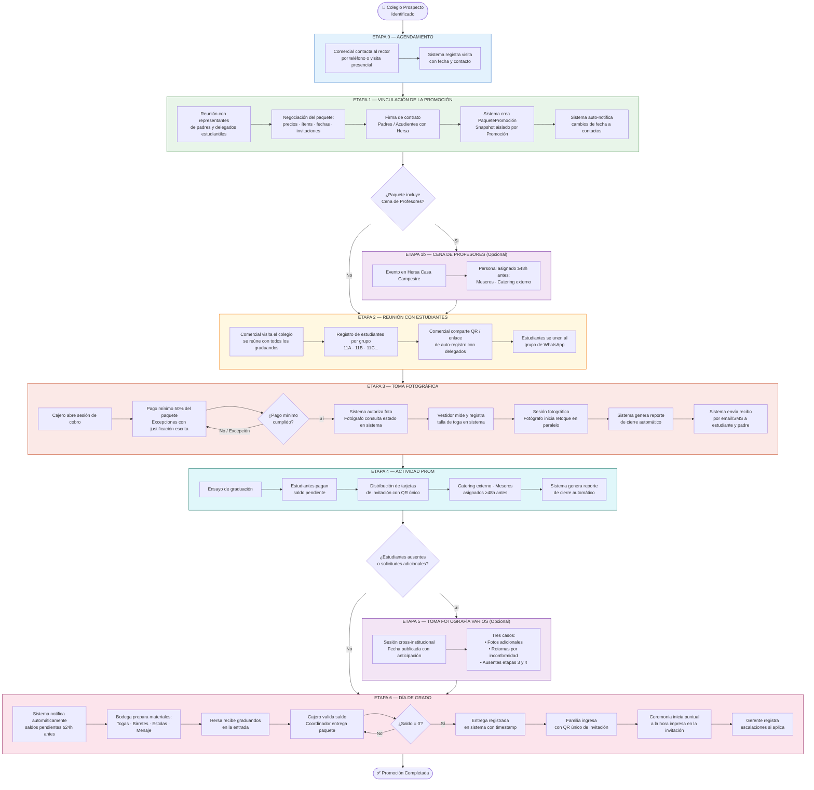
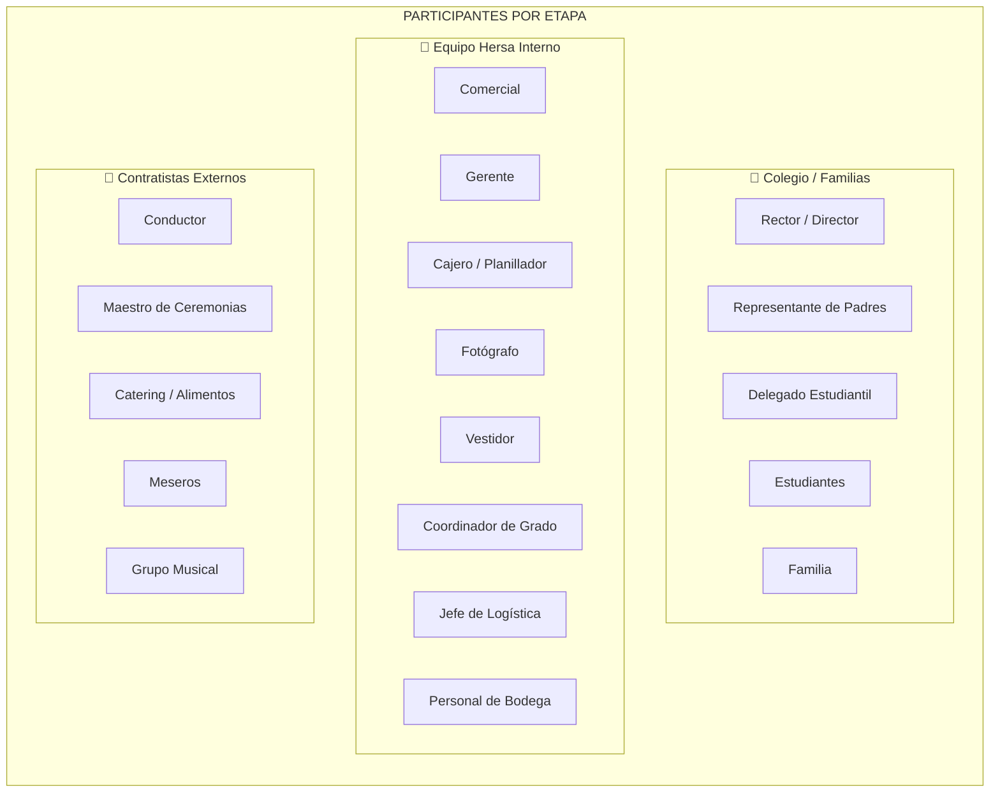
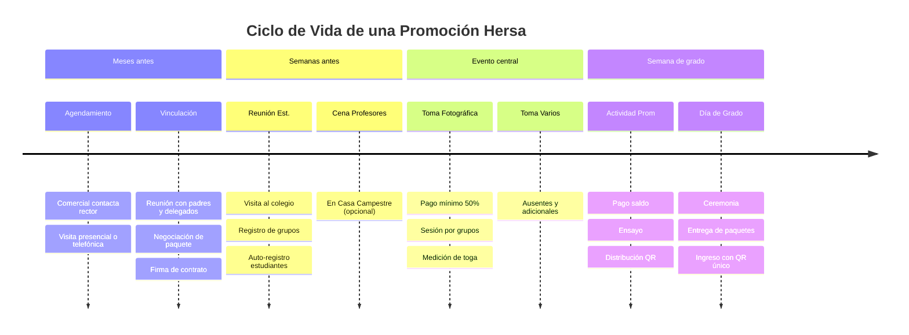
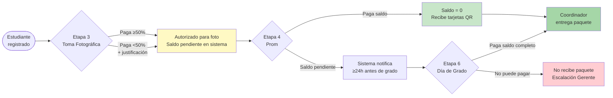

# Proceso Operativo Hersa — Diagrama General

> **Audiencia:** Gerentes y stakeholders internos  
> **Versión:** 1.0 — Abril 2026  
> **Estado:** Pendiente validación gerencial

---

## Flujo Principal: De Prospecto a Graduación

---

## Mapa de Roles por Etapa

---

## Línea de Tiempo del Proceso

---

## Ciclo Financiero del Estudiante

---

> **Cómo exportar a PDF:**  
> Abrir este archivo en VS Code con la extensión *Markdown Preview Mermaid Support* instalada → clic derecho en el preview → *Open with Live Preview* → imprimir a PDF.  
> Alternativamente: copiar cada bloque Mermaid en [mermaid.live](https://mermaid.live) para exportar cada diagrama individualmente como imagen o SVG.
